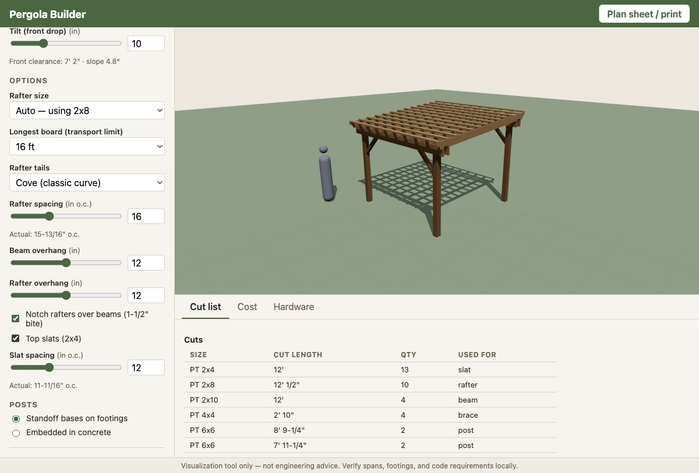

# Pergola Builder

A client-side web app that designs a freestanding pergola from your dimensions — live 3D rendering, a bin-packed cut list, cost estimate, hardware list, and a printable plan sheet. All lumber is pressure-treated in common nominal sizes (6x6 posts, doubled 2x10 beams, 2x4–2x10 rafters, 2x4 slats, 4x4 braces) and common stock lengths (8/10/12/16 ft).



> **Disclaimer:** visualization tool only — not engineering advice. Verify spans, footings, and code requirements locally.

## Features

- **Parametric design** — set width (6–40 ft), depth (6–20 ft), and head clearance (7–12 ft); the app places posts (adding interior posts past a 14-ft beam span), doubled 2x10 beams spliced at interior posts, span-sized rafters, knee braces, and optional top slats.
- **Live 3D view** — react-three-fiber scene with orbit controls, shadows, a 1-ft ground grid, and a 6-ft human silhouette for scale.
- **Tilt (shed slope)** — drop the front side for rain runoff; front posts are cut shorter, rafters lengthen by 1/cos of the pitch, and you're warned if front clearance falls below 6' 8".
- **Rafter bite** — rafters seat into level notches cut over each beam assembly so they lock over the headers, even on a sloped roof. Notch depth clamps to a third of shallow rafters.
- **Rafter tails** — square, chamfered, bullnose, or classic cove profiles, rendered as real extruded geometry.
- **Rafter sizing** — automatic by span (2x8, upgrading to 2x10) or forced to 2x4/2x6/2x8/2x10 with rule-of-thumb span warnings.
- **Cut list & shopping list** — cuts are aggregated and packed onto purchasable boards (first-fit-decreasing with a 1/8" saw kerf), then each board shrinks to the smallest stock length that fits. A per-board cutting plan is included.
- **Longest-board cap** — tell it the longest board you can transport (8/10/12/16 ft); packing respects it and warns about one-piece cuts (like rafters) that physically need longer stock. The Cost tab compares total lumber cost under every cap.
- **Cost estimate** — editable unit prices (persisted in your browser) for lumber and hardware, with sensible big-box defaults.
- **Hardware list** — post bases or embedded-post concrete, carriage bolts, structural screws, deck screws, concrete bags, all counted from the design.
- **Printable plan sheet** — a print-ready page with a 3D snapshot, dimensioned plan and elevation SVG drawings, the full cut list, hardware, cost, and build notes.

## Getting started

```bash
npm install
npm run dev      # http://localhost:5173
```

```bash
npm test         # engine unit tests (vitest)
npm run build    # type-check + production build → dist/
npm run preview  # serve the production build
```

## How it works

The core is a pure-TypeScript design engine (`src/engine/`) with zero React or three.js imports:

```
designPergola(config) → { members, warnings, meta }
```

Every board is a typed `Member` (role, nominal size, cut length, position, rotation, optional tail profile and notch polygons). The 3D scene, cut list, hardware counts, cost estimate, and print diagrams **all derive from that one output** — no component computes geometry independently.

Conventions:

- The engine works in **inches**; UI inputs are feet; the three.js scene uses **1 unit = 1 ft** via a single `toScene()` helper.
- Y-up, origin at the footprint center at grade. Beams run along X, rafters along Z.
- Actual lumber dimensions come from one `LUMBER` table (a 2x10 is 1.5" × 9.25") and cut lengths round to 1/16" so float noise never splits cut-list rows.

```
src/
├── engine/     # pure TS: design rules, cut-list packing, hardware, cost (+ vitest tests)
├── three/      # r3f scene: member meshes (boxes or extruded profiles), ground, lighting
├── ui/         # input panel, cut list / cost / hardware tables
├── print/      # plan sheet with dimensioned SVG diagrams
└── store/      # zustand: config + prices (prices persist to localStorage)
```

## Stack

Vite · React 19 · TypeScript · three.js via @react-three/fiber + drei · zustand · vitest
